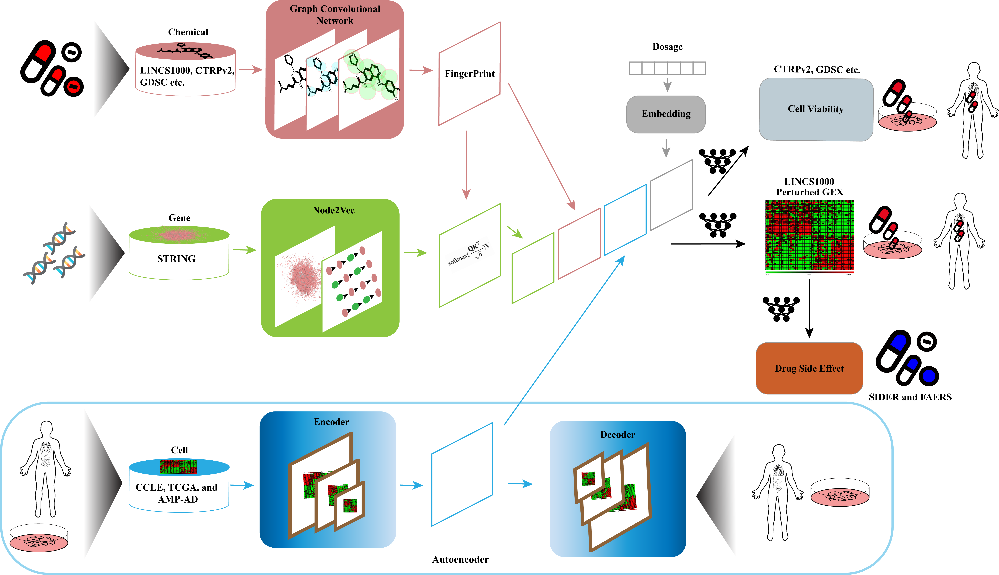

# MultiDCP: Predictive Modeling of Multiplex Chemical Phenomics for Novel Cells and Individual Patients: Application to Personalized Alzheimer’s Disease Drug Repurposing

Shield: [![CC BY-NC 4.0][cc-by-nc-shield]][cc-by-nc]

This work is licensed under a
[Creative Commons Attribution-NonCommercial 4.0 International License][cc-by-nc].

[![CC BY-NC 4.0][cc-by-nc-image]][cc-by-nc]

[cc-by-nc]: http://creativecommons.org/licenses/by-nc/4.0/
[cc-by-nc-image]: https://licensebuttons.net/l/by-nc/4.0/88x31.png
[cc-by-nc-shield]: https://img.shields.io/badge/License-CC%20BY--NC%204.0-lightgrey.svg

MultiDCP is multi-tasks transfer learning based model. It is desiged to perform multiple tasks including dose-dependent chemical-induced differential gene expression predictions (chemical transcriptomics) and cell viability predictions for *de novo* drugs and *de novo* cell lines. This model includes four input components, a graph convolutional network based chemical fingerprint embedding module, a chemical substructure-gene interactions module, a knowledge-enabled autoencoder module and a dosage information embedding module (Figure 1). This superior performance is attributed to an innovative knowledge-enabled autoencoder for gene expression profiles, integration of multiple diverse labeled and unlabeled omics data, and the joint training of the multiple prediction tasks. We further apply MultiDCP to conduct drug repurposing for individual Alzheimer’s disease (AD) patients. The clinical potential of proposed drug leads on AD is supported by existing experimental and clinical evidence.



# Prerequisites
Linux

NVIDIA GPU is strongly recommended for speed. CPU is also supported but is slow.

# Docker installation
```
cd MultiDCP/script/docker_folder
docker build --network=host -t multidcp .
nvidia-docker run --name multidcp -it --privileged=true --network=host --rm -v /path/to/MultiDCP/:/workspace multidc
```

# Install required packages
```
cd multidcp MultiDCP/script/docker_folder
pip install -r ./requirements.txt
conda install --file ./conda_requirements.txt
```

# Reproducing experiments
1. Download data into MultiDCP/MultiDCP/data

[](https://doi.org/10.5281/zenodo.5172809)
```
pip install zenodo-get
zenodo_get 10.5281/zenodo.5172809
```

2. Train the model
```
cd MultiDCP/script
./train_multidcp_ae.sh
```

# Making Predictions

Once the model is trained, you can use it to predict gene expression changes for new compounds on specific cell lines.

## Example: Predicting Food Molecule Effects on MCF7 Cells

We provide an example script that demonstrates how to predict the transcriptomic effects of food molecules on the MCF7 cell line:

```bash
python predict_food_molecules_mcf7.py
```

This script will:
- Load the trained MultiDCP model
- Process food molecule structures (SMILES format)
- Predict differential gene expression for 978 landmark genes
- Save predictions to `MultiDCP_data/predictions/`

### Prediction Output Format

The raw predictions contain generic column names (`gene_0`, `gene_1`, ..., `gene_977`). To convert these to actual gene names (e.g., DDR1, PAX8, RPS5), use the provided utility script:

```bash
python add_gene_names_to_predictions.py
```

This creates a more interpretable output file with columns:
- **Metadata columns**: `inchikey`, `compound_name`, `smiles`, `cell_line`, `dosage`
- **Gene expression columns**: `DDR1`, `PAX8`, `RPS5`, ..., `NPEPL1` (978 genes total)

**Example output structure:**
```
MultiDCP_data/predictions/
├── food_molecules_mcf7_predictions.csv              # Raw predictions with gene_0, gene_1, ...
└── food_molecules_mcf7_predictions_with_gene_names.csv  # Human-readable gene names
```

### Customizing Predictions

To predict effects for your own compounds:

1. Prepare a CSV file with compound information (InChIKey, name, SMILES)
2. Modify the prediction script to load your compounds
3. Specify the target cell line and dosage
4. Run the prediction script
5. Use `add_gene_names_to_predictions.py` to add gene names

The 978 landmark genes predicted by MultiDCP are defined in `data/gene_vector.csv`.


